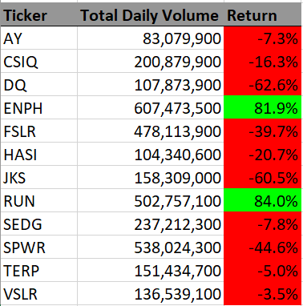

# Stock Analysis With Excel VBA

## Overview of Project
### Purpose
The pupose of this project is to build a Microsoft Excel VBA code that analyze the provided dataset of stock and evaluate stocks' performance. In addition, the codes are expected to loop themselves to analyze the entire dataset at once by utilizing `for`loop and conditional settings. Lastly, we are further challenged to refactor the written codes to be efficient - by taking fewer steps, using less memory, or improving the logic of the code to make it easier for future users to read.

### The Data
The provided dataset have the 12 different stock information listed in two separate charts from year 2017 and 2018. On each chart, followings information are included; Ticker name of stock, Date the stock was issued, the opening, closing, highest, and lowest price, and the volume. In order to measure the performance of stocks, we utilized stocks' ticker, closing price and volume to calculate their yearly return.

## Results
### Analysis

+ With the refactoring of nested `for` loops into one by usint `tickerIndex` variables, the execution times for each code were "0.1875" and "0.1796875" respective to the year 2017 and the year 2018 data.
   
   ***Time on VBA_Challenge_2017***
   
   

   ***Time on VBA_Challenge_2018***
   
   

   Compared to the original scripts attached below, the execution times were shorten by almost 1second.

   ***Time on VBA_Challenge_2017withoutRefactor***
   
   

 
   ***Time on VBA_Challenge_2018withoutRefactor***
   
   

+ Next, the below two screenshots present that the described codes can simply run by anyone by clicking the module button "Analysis Refactored" and clear the worksheet with "Clear Sheet" button
   
   ***Table of VBA_Challenge_2017Worksheet***
   
   
   
   ***Table of VBA_Challenge_2018Worksheet***
   
   

+ Now, let us analyze the tables output from the written codes to determine which stocks performed well in the year of 2017 and the year of 2018.

   ***Table of VBA_Challenge_2017Table***
   
   
   
   + Revewing the performances of 12 stocks from the year 2017, we can compare how well each stock performed through  **Return (%).** 
     With a first glance, we can tell that the stock "TERP" is not profittable as the return percentage is negative value (-7.2%). On the otherhand, all the rest of 11 stocks are outputting the positive return in this year. Could this be that all other 11 stocks are well performing stocks to invest? 
In order to further track the performance of the stocks, let us review the result from the year of 2018.

   ***Table of VBA_Challenge_2018Table***
   
   
   
   + From the year 2018 table, we see a drastic change in the stocks' return percentage compared to that from the year 2017. Among the 12 stocks, only **"ENPH"** and **"RUN"** were the stocks with positive return percentage. 
     Tracing back to the year 2017 result again, "ENPH" was also the top three in terms of return percentage, 129.5%, while "RUN" was 5.5%. Given both stocks' return percentages are now above 80%, we can estimate that these two stocks are better choices to invest compared to other 10 stocks.

## Summary
### Pros and Cons of Refactoring Code

### The Advantages of Refactoring Stock Analysis
