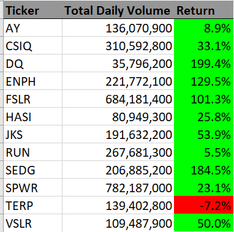

# Stock Analysis With Excel VBA

## Overview of Project
### Purpose
The pupose of this project is to build a Microsoft Excel VBA code that analyze the provided dataset of stock and evaluate stocks' performance. In addition, the codes are expected to loop themselves to analyze the entire dataset at once by utilizing `for`loop and conditional settings. Lastly, we are further challenged to refactor the written codes to be efficient - by taking fewer steps, using less memory, or improving the logic of the code to make it easier for future users to read.

### The Data
The provided dataset have the 12 different stock information listed in two separate charts from year 2017 and 2018. On each chart, followings information are included; Ticker name of stock, Date the stock was issued, the opening, closing, highest, and lowest price, and the volume. In order to measure the performance of stocks, we utilized stocks' ticker, closing price and volume to calculate their yearly return.


## Results
### Analysis

+ The below VBA code is built to output Ticker, Totaly Daily Volume, and Return of each stock. Also, the code compiles functions to format the output code and report its execution time; 
1. Set up input box code to determine the **Year** of stock data we want to analyze. Also, create variables `startTime` and `endtime` to track the execution time of the code. The `Timer` code is there to start measuring the execution time.
```
    Dim startTime As Single
    Dim endTime  As Single

    yearValue = inputbox("What year would you like to run the analysis on?")

    startTime = Timer
```

2. Enter the worksheet's title and headers for tables. Note that `Worksheets("All Stocks Analysis").Activate` code is there to ensure the table is created on the worksheet "All Stocks Analysis" that we want to report.
```
    'Format the output sheet on All Stocks Analysis worksheet
    Worksheets("All Stocks Analysis").Activate
    
    Range("A1").Value = "All Stocks (" + yearValue + ")"
    
    'Create a header row
    Cells(3, 1).Value = "Ticker"
    Cells(3, 2).Value = "Total Daily Volume"
    Cells(3, 3).Value = "Return"
 ```

3. Initialize array of all 12 tickers.
```
'Initialize array of all tickers
    Dim tickers(12) As String
    
    tickers(0) = "AY"
    tickers(1) = "CSIQ"
    tickers(2) = "DQ"
    tickers(3) = "ENPH"
    tickers(4) = "FSLR"
    tickers(5) = "HASI"
    tickers(6) = "JKS"
    tickers(7) = "RUN"
    tickers(8) = "SEDG"
    tickers(9) = "SPWR"
    tickers(10) = "TERP"
    tickers(11) = "VSLR"
```
4. Create and initialize the variables `tickerIndex`  and output arrays `tickerVolume, tickerStartingPrices,` and `tickerEndingPrices` to organize the upcoming code.
```
    '1a) Create a ticker Index
   tickerIndex = 0
    '1b) Create three output arrays
    Dim tickerVolumes(0 To 11) As Long
    Dim tickerStartingPrices(0 To 11) As Single
    Dim tickerEndingPrices(0 To 11) As Single
    ''2a) Create a for loop to initialize the tickerVolumes to zero.
    For i = 0 To 11
        tickerVolumes(i) = 0
        tickerStartingPrices(i) = 0
        tickerEndingPrices(i) = 0
    Next i
```
5. Write `for` loop and `If Then` codes to determine `tickerVolume, tickerStartingPrices,` and `tickerEndingPrices`. 
```
''2b) Loop over all the rows in the spreadsheet.
    For i = 2 To RowCount
        '3a) Increase volume for current ticker
        tickerVolumes(tickerIndex) = tickerVolumes(tickerIndex) + Cells(i, 8).Value
        '3b) Check if the current row is the first row with the selected tickerIndex.
         If Cells(i - 1, 1).Value <> tickers(tickerIndex) And Cells(i, 1).Value = tickers(tickerIndex) Then
                tickerStartingPrices(tickerIndex) = Cells(i, 6).Value    
         End If
        '3c) check if the current row is the last row with the selected ticker
         'If the next row's ticker doesn't match, increase the tickerIndex.
          If Cells(i + 1, 1).Value <> tickers(tickerIndex) And Cells(i, 1).Value = tickers(tickerIndex) Then
               tickerEndingPrices(tickerIndex) = Cells(i, 6).Value   
          End If
            '3d Increase the tickerIndex.
           If Cells(i + 1, 1).Value <> tickers(tickerIndex) And Cells(i, 1).Value = tickers(tickerIndex) Then
                tickerIndex = tickerIndex + 1
           End If
    Next i
```
6. Write the formula to output Ticker, Total Daily Volume, and Return to the table.
```    
    '4) Loop through your arrays to output the Ticker, Total Daily Volume, and Return.
    For i = 0 To 11
        Worksheets("All Stocks Analysis").Activate
        Cells(4 + i, 1).Value = tickers(i)
        Cells(4 + i, 2).Value = tickerVolumes(i)
        Cells(4 + i, 3).Value = tickerEndingPrices(i) / tickerStartingPrices(i) - 1
    Next i
```
7. Format the table and utilize conditional statement to fill Return cells' color whether the values are positive or negative.
```
    'Formatting
    Worksheets("All Stocks Analysis").Activate
    Range("A3:C3").Font.FontStyle = "Bold"
    Range("A3:C3").Borders(xlEdgeBottom).LineStyle = xlContinuous
    Range("A3:C3").Interior.ColorIndex = 48
    Range("B4:B15").NumberFormat = "#,##0"
    Range("C4:C15").NumberFormat = "0.0%"
    Columns("B").AutoFit

    dataRowStart = 4
    dataRowEnd = 15
    For i = dataRowStart To dataRowEnd
        If Cells(i, 3) > 0 Then
            Cells(i, 3).Interior.Color = vbGreen
        Else
            Cells(i, 3).Interior.Color = vbRed
        End If
    Next i
```
8. Lastly, have a message function code to report execution time of the code.
```
endTime = Timer
    MsgBox "This code ran in " & (endTime - startTime) & " seconds for the year " & (yearValue)
```


+ With the refactoring of nested `for` loops into one by usint `tickerIndex` variables, the execution times for each code were "0.1875" and "0.1796875" respective to the year 2017 and the year 2018 data.
   
   ***Time on VBA_Challenge_2017***
   
   


   ***Time on VBA_Challenge_2018***
   
   

   Compared to the original scripts attached below, the execution times were shorten by almost 1second.


   ***Time on VBA_Challenge_2017withoutRefactor***
   
   

 
   ***Time on VBA_Challenge_2018withoutRefactor***
   
   


+ Next, the below two screenshots present that the described codes can simply run by anyone by clicking the module button "Analysis Refactored" and clear the worksheet with "Clear Sheet" button
   
   ***Table of VBA_Challenge_2017Worksheet***
   
   
   
   ***Table of VBA_Challenge_2018Worksheet***
   
   

+ Now, let us analyze the tables output from the written codes to determine which stocks performed well in the year of 2017 and the year of 2018.

   ***Table of VBA_Challenge_2017Table***
   
   
   
   + Revewing the performances of 12 stocks from the year 2017, we can compare how well each stock performed through  **Return (%).** 
     With a first glance, we can tell that the stock "TERP" is not profittable as the return percentage is negative value (-7.2%). On the otherhand, all the rest of 11 stocks are outputting the positive return in this year. Could this be that all other 11 stocks are well performing stocks to invest? 
In order to further track the performance of the stocks, let us review the result from the year of 2018.

   ***Table of VBA_Challenge_2018Table***
   
   
   
   + From the year 2018 table, we see a drastic change in the stocks' return percentage compared to that from the year 2017. Among the 12 stocks, only **"ENPH"** and **"RUN"** were the stocks with positive return percentage. 
     Tracing back to the year 2017 result again, "ENPH" was also the top three in terms of return percentage, 129.5%, while "RUN" was 5.5%. Given both stocks' return percentages are now above 80%, we can estimate that these two stocks are better choices to invest compared to other 10 stocks.


## Summary
### Pros and Cons of Refactoring Code

Pros of refactoring code is to brush up your code to be better organized. Thus refactored code will look better if you handover the written code to other person or you revisit the code later. Also, the more organized a code refactored, it would be easier to make any modification of code, and or add more variables to analyze.
The cons of refactoring code is that we face some risk of making new bugs through the process.

### The Advantages of Refactoring Stock Analysis

Reviewing the exectution times of each macro with and without refactoring, the biggest advantage is shortening of execution time. As mentioned already in the Analysis section, the refactored codes took almost 1second shorter execution time compared to the time for original code with two `for` loops running. Attaching the results from both the original code and the code with reactoring as comparison again.

***Time on VBA_Challenge_2017withoutRefactor***
   

   
***Time on VBA_Challenge_2017***
   


